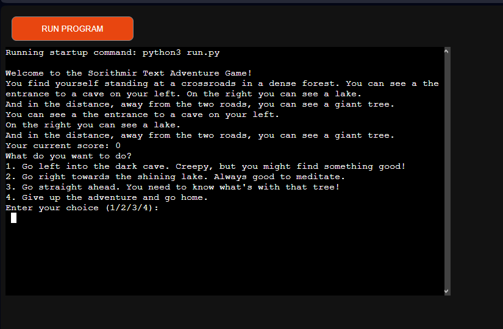
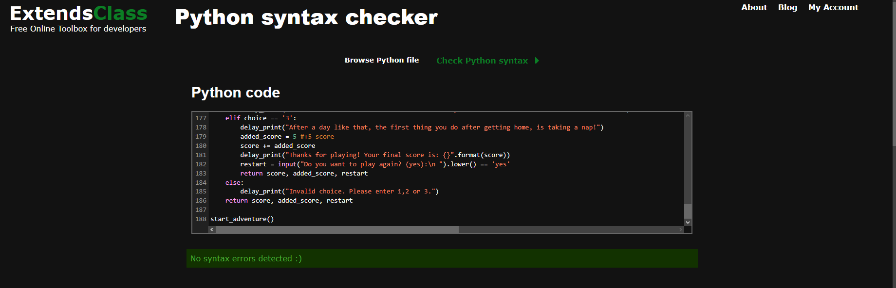

# Sorithmir Text Adventure Game

Welcome to the Sorithmir Text Adventure Game! This is a simple text-based adventure game written in Python. In this game, you will embark on an adventure in a dense forest and make choices that affect your score and the outcome of the game.

## How to Play

1. You will find yourself at a crossroads in a dense forest with three options:

- Go left into the dark cave.
- Go right towards the shining lake.
- Go straight ahead to explore the giant tree.

2. Explore these locations, make choices, and collect scores.

- In the cave, you might find hidden treasures.
- At the lake, you can relax or go for a swim.
- The giant tree holds a portal to a magical land.

3. Your goal is to maximize your score and uncover the secrets of the forest.

4. If you decide to quit the adventure, you can do so at certain times.

5. After each playthrough, you can choose to play again.

6. Advance through the forest by typing one of the choices.

## Scoring

- Your final score is determined by the choices you make during the game.
- Some choices lead to more points than others, so choose wisely.
- Try to achieve the highest score possible and explore different paths.

## Features

- Every stage has multiple choices, the player can choose where to go.
- At most stages of the game, a restart is possible.
- Your score is tracked after each location.

## Testing

- I have tested almost every combination of choices, including going to the same location over and over again.
- Passed the code through [ExtendsClass](https://extendsclass.com/python-tester.html)

### Bugs

#### Solved

- There was one point in the coding, where the console would return an error, after the user went to the cave, then decided to abandon the quest and then tried to restart. It was because I forgot to include the restart variable in the return values.
- There was a point in the coding process, where at the last stage, the score wouldn't correctly add up. That was because I didn't use the "score += added_score" property properly. 
*That's a nice tongue twister, try saying "property properly" 5 times in a row.*

#### Remaining

- No bugs remaining.

### Validator

- ExtendsClass
    - No errors were returned from ExtendsClass.com.

## Deployment

This project was deployed using Code Institute's mock terminal for Heroku.

- Steps for deployment:
    - Clone repository.
    - Create a new Heroku app.
    - Set the buildbacks to Python and NodeJs in that order. *You can drag and drop them to swap, if you put them in the wrong order*
    - Link the Heroku app to the repository.
    - Click on *Deploy*.

## Credits

- Code Institute for the deployment terminal.
- Code Institute for the Sample README.md that I got inspired from, to write my README.md file.

##### Have fun and enjoy your adventure in the world of Sorithmir!

